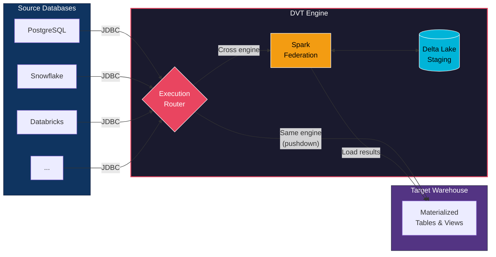

<p align="center">
  
</p>

<h1 align="center">DVT &mdash; Data Virtualization Tool</h1>

<p align="center">
  <strong>Connect every database. Move data across engines. Transform in place.</strong><br/>
  The declarative pipeline tool that brings dbt's power to the ETLT domain.
</p>

<p align="center">
  <a href="https://pypi.org/project/dvt-core/"></a>
  <a href="https://pypi.org/project/dvt-core/"></a>
  <a href="https://github.com/heshamh96/dvt/blob/master/LICENSE"></a>
</p>

---

## What is DVT?

**DVT (Data Virtualization Tool)** is a fork of [dbt-core](https://github.com/dbt-labs/dbt-core) that extends the dbt experience into the **ETLT (Extract, Transform, Load, Transform)** domain. If you know dbt, you already know DVT -- same CLI, same SQL models, same Jinja templating, same DAG-based execution. The difference is what happens under the hood.

Where dbt connects to **one** data warehouse at a time, DVT connects to **all of them at once**. You define sources across PostgreSQL, Snowflake, Databricks, and any other database in a single project, and DVT figures out how to get the data where it needs to go.

### The ETLT Pattern

Traditional ETL tools force you to write imperative extraction scripts. dbt gave us declarative transformations but only within a single warehouse. DVT closes the gap:

1. **Extract** -- DVT reads from any source database using Spark JDBC connectors, automatically resolving which sources need to be pulled from which targets.
2. **Load (Staging)** -- Extracted data lands in a Delta Lake staging layer, giving you ACID transactions, time travel, and efficient incremental reads.
3. **Transform** -- Your SQL models run against the target warehouse, exactly like dbt. Same `ref()`, same `source()`, same materializations.
4. **Load (Final)** -- Results materialize in the target warehouse as tables or views, just as you'd expect.

### Adapter Pushdown vs. Spark Federation

DVT is smart about when to use Spark and when not to:

- **Same-engine query?** DVT pushes the SQL directly to the target database adapter -- zero Spark overhead, identical to dbt behavior.
- **Cross-engine query?** DVT spins up a Spark session, extracts the relevant sources via JDBC, registers them as DataFrames, and executes your SQL across engines using Spark's federation capabilities.

You never have to think about this. You write SQL. DVT decides the execution path.

---

## Key Features

- **Multi-Source Federation** -- Join data from PostgreSQL, Snowflake, Databricks, and more in a single SQL model. DVT handles the cross-engine orchestration transparently.

- **Adapter Pushdown** -- When your model and its sources live on the same database, DVT pushes execution directly to the adapter with zero overhead. Identical performance to dbt.

- **Delta Lake Staging** -- All intermediate data flows through Delta Lake, giving you ACID transactions, schema enforcement, and efficient incremental processing with append/overwrite modes.

- **Incremental Models** -- Full support for `merge`, `append`, and `delete+insert` strategies. `{{ this }}` resolves to the staging Delta table for correct anti-join patterns across engines.

- **Predicate Pushdown** -- DVT's optimizer analyzes your SQL and pushes WHERE clauses down to the source databases during extraction, minimizing data movement over the wire.

- **`dvt sync`** -- One command to set up your entire environment: installs database adapters, PySpark, JDBC drivers, and native cloud connectors. No manual JAR hunting.

- **`dvt debug`** -- Comprehensive diagnostic command that validates all targets, computes, buckets, and database connections in one shot. Know exactly what's configured and what's reachable before you run anything.

- **dbt-Compatible** -- Your existing dbt projects, packages, macros, and tests work with DVT. The CLI commands you know (`run`, `build`, `test`, `seed`, `docs`) all work the same way.

---

## How DVT Works



**Execution flow:**
- The **Execution Router** inspects every model and its upstream sources. If the model's target matches all source targets, it uses **adapter pushdown** (direct SQL, no Spark). If sources span multiple engines, it routes through **Spark Federation**, which extracts data via JDBC, stages it in **Delta Lake**, executes the cross-engine SQL, and loads the results into the **target warehouse**.

---

## Tested Adapters

> **Note:** DVT is currently tested and validated against the following database adapters. Support for additional adapters is planned and will be included in future releases.

| Adapter | Status | Notes |
|---------|--------|-------|
| **PostgreSQL** | Tested | Full support -- pushdown and federation |
| **Snowflake** | Tested | Full support -- pushdown and federation, JDBC warehouse passthrough |
| **Databricks** | Tested | Full support -- pushdown and federation, native connector for bulk transfer |

More adapters (BigQuery, Redshift, MySQL, SQL Server, and others) are on the roadmap. DVT's architecture is adapter-agnostic -- any database with a dbt adapter and a JDBC driver can be integrated.

---

## Quick Start

### Prerequisites

- **Python 3.10 -- 3.13** (Python 3.14 is not yet supported by the ecosystem)
- **Java 17** (required for Apache Spark -- Spark 4.x needs Java 17 or 21)
- **uv** (recommended) or **pip** for package management

### 1. Install DVT

**Using uv (recommended):**

```bash
# Create a new project with a supported Python version
uv init my-dvt-project --python 3.12
cd my-dvt-project

# Add dvt-core
uv add dvt-core
```

> **Important:** If your system default Python is 3.14+, you **must** specify `--python 3.12` (or 3.10/3.11/3.13) when creating the project. Python 3.14 is pre-release and not supported by DVT's upstream dependencies.

**Using pip:**

```bash
# Ensure you're using Python 3.10-3.13
python3.12 -m venv .venv
source .venv/bin/activate

pip install dvt-core
```

### 2. Initialize Your Project

```bash
dvt init
```

This scaffolds a new DVT project and creates the configuration directory at `~/.dvt/` with:

| File | Purpose |
|------|---------|
| `profiles.yml` | Database connection profiles (targets) |
| `computes.yml` | Spark compute engine configuration |
| `buckets.yml` | Staging storage configuration (local filesystem) |

### 3. Configure Your Connections

Edit `~/.dvt/profiles.yml` to define your database targets. See [Configuration Files](#configuration-files) below for full annotated examples.

### 4. Sync Your Environment

```bash
dvt sync
```

This is where DVT shines. A single command that:
- Installs the correct database adapters (`dbt-postgres`, `dbt-snowflake`, etc.) based on your profiles
- Installs the correct PySpark version from your `computes.yml`
- Downloads JDBC drivers for every database in your profile
- Downloads native cloud connectors (Snowflake, Databricks) for optimized data transfer
- Validates Java version compatibility with your Spark version

No more hunting for JAR files, no more version mismatches. One command, everything set up.

### 5. Validate Your Setup

Before running anything against real databases, validate that everything is properly configured:

**Check all connections, computes, and buckets:**

```bash
dvt debug
```

`dvt debug` gives you a full diagnostic report:
- All configured targets and whether they're reachable
- Compute engine configuration and Spark readiness
- Bucket configuration and storage accessibility
- Connection test for any specific target with `--connection <target_name>`

You can also filter the output:

```bash
dvt debug --debug-target          # Show only target configurations
dvt debug --debug-compute         # Show only compute configurations
dvt debug --debug-bucket          # Show only bucket configurations
dvt debug --connection pg_dev     # Test a specific database connection
```

**Validate your project parses correctly:**

```bash
dvt parse
```

`dvt parse` reads every model, source, test, seed, and macro in your project and validates that:
- All `ref()` and `source()` references resolve correctly
- The DAG has no cycles
- All configurations are valid
- Jinja compilation succeeds

If `dvt debug` says your connections are good and `dvt parse` says your project is valid, you're ready to run.

### 6. Run Your Models

```bash
# Run all models
dvt run

# Run a specific model
dvt run --select my_model

# Run with full refresh (DROP + CREATE instead of TRUNCATE + INSERT)
dvt run --full-refresh

# Run everything: seeds, models, and tests in DAG order
dvt build
```

---

## Configuration Files

### `profiles.yml` -- Database Connections

Location: `~/.dvt/profiles.yml`

```yaml
my_project:
  target: pg_dev                         # Default target
  outputs:

    # PostgreSQL target (read/write)
    pg_dev:
      type: postgres
      host: localhost
      port: 5432
      user: analytics
      password: "{{ env_var('PG_PASSWORD') }}"
      dbname: warehouse
      schema: public
      threads: 4

    # Snowflake target (read/write)
    sf_prod:
      type: snowflake
      account: xy12345.us-east-1
      user: DVT_USER
      password: "{{ env_var('SF_PASSWORD') }}"
      role: TRANSFORM_ROLE
      warehouse: COMPUTE_WH
      database: ANALYTICS
      schema: PUBLIC
      threads: 4

    # Databricks target (read/write)
    dbx_dev:
      type: databricks
      host: adb-1234567890.azuredatabricks.net
      http_path: /sql/1.0/warehouses/abc123
      token: "{{ env_var('DBX_TOKEN') }}"
      schema: default
      catalog: main
      threads: 4
```

**Multi-source federation:** In your schema YAML files, each source block can specify which target to read from using the `connection` property:

```yaml
# models/staging/sources.yml
sources:
  - name: crm_data
    connection: pg_dev                   # Read from PostgreSQL
    tables:
      - name: customers
      - name: orders

  - name: finance_data
    connection: sf_prod                  # Read from Snowflake
    tables:
      - name: transactions
      - name: accounts
```

Now a model can join data from both sources:

```sql
-- models/marts/customer_transactions.sql
SELECT
    c.customer_id,
    c.name,
    t.amount,
    t.transaction_date
FROM {{ source('crm_data', 'customers') }} c
JOIN {{ source('finance_data', 'transactions') }} t
    ON c.customer_id = t.customer_id
```

DVT detects that `crm_data` lives on PostgreSQL and `finance_data` lives on Snowflake, extracts both via Spark JDBC, joins them in Spark, and loads the result into your default target.

### `computes.yml` -- Spark Configuration

Location: `~/.dvt/computes.yml`

```yaml
my_project:
  target: local_spark                    # Default compute
  computes:
    local_spark:
      type: spark
      version: "4.0.0"                  # PySpark version (run 'dvt sync' after changing)
      master: "local[*]"                # Use all available CPU cores

      config:
        spark.driver.memory: "4g"
        spark.executor.memory: "4g"
        spark.sql.adaptive.enabled: "true"
        spark.sql.parquet.compression.codec: "zstd"

      delta:
        optimize_on_write: false
        cleanup_retention_hours: 0
        parallel_cleanup: false

      jdbc_extraction:                   # Settings for reading from databases
        num_partitions: 8
        fetch_size: 10000

      jdbc_load:                         # Settings for writing to databases
        num_partitions: 4
        batch_size: 10000
```

> **Java compatibility:** Spark 3.x requires Java 8, 11, or 17. Spark 4.x requires Java 17 or 21. DVT sync will warn you if your Java version is incompatible.

### `buckets.yml` -- Staging Storage

Location: `~/.dvt/buckets.yml`

```yaml
my_project:
  target: local_staging                  # Default bucket
  buckets:
    local_staging:
      type: filesystem                   # Local disk staging (default)
```

### `dbt_project.yml` -- Project Configuration

Location: Project root

```yaml
name: "my_project"
version: "1.0.0"
profile: "my_project"                    # References a profile in profiles.yml

model-paths: ["models"]
analysis-paths: ["analyses"]
test-paths: ["tests"]
seed-paths: ["seeds"]
macro-paths: ["macros"]
snapshot-paths: ["snapshots"]

clean-targets:
  - "target"
  - "dvt_packages"

# Optional: pin adapter versions for dvt sync
# require-adapters:
#   postgres: ">=1.0.0"
#   snowflake: ">=1.5.0"
```

---

## CLI Command Reference

DVT provides all the commands you know from dbt, plus DVT-specific additions for multi-engine orchestration.

### DVT-Specific Commands

| Command | Description |
|---------|-------------|
| `dvt sync` | Sync your environment: install adapters, PySpark, JDBC drivers, and cloud connectors from your config files. Run this after changing `profiles.yml` or `computes.yml`. |
| `dvt debug` | Comprehensive diagnostics: validate all targets, computes, buckets, and test database connections. Supports `--connection <target>` to test a specific target. |
| `dvt clean` | Extended cleanup: removes build artifacts and supports `--optimize` for Delta Lake OPTIMIZE + VACUUM, and `--older-than` for age-based staging cleanup. |

### Core Commands

| Command | Description |
|---------|-------------|
| `dvt run` | Compile SQL models and execute against the target database. Supports `--select`, `--exclude`, `--full-refresh`. |
| `dvt build` | Run all seeds, models, and tests in DAG order. The "do everything" command. |
| `dvt seed` | Load CSV seed files into any target warehouse. Uses Spark for high-performance bulk loading, supporting larger files than dbt's native seed. |
| `dvt compile` | Generate executable SQL without running it. Output goes to `target/`. |
| `dvt show` | Compile and run a query, returning a preview without materializing results. |
| `dvt retry` | Retry only the nodes that failed in the previous run. |
| `dvt docs generate` | Generate the documentation website for your project. |
| `dvt init` | Initialize a new DVT project with scaffolded directory structure and config files. |
| `dvt parse` | Parse the full project and validate all references, configs, and Jinja compilation. |
| `dvt deps` | Install dbt packages from `packages.yml`. Supports `--add-package` and `--upgrade`. |
| `dvt list` / `dvt ls` | List all resources (models, tests, sources, etc.) in your project. |
| `dvt docs serve` | Serve the documentation website locally for browsing. |

### Inherited from dbt (not yet validated in DVT)

These dbt-core commands are available in DVT but have not been fully tested or adapted for multi-engine federation. They may work as expected for single-target use cases, but behavior across federated sources is not guaranteed. Use at your own discretion.

| Command | Description |
|---------|-------------|
| `dvt test` | Run data tests on deployed models. |
| `dvt snapshot` | Execute snapshot definitions for slowly changing dimensions. |
| `dvt clone` | Create clones of selected nodes based on a prior manifest state. |
| `dvt run-operation` | Run a named macro with supplied arguments. |
| `dvt source freshness` | Check the current freshness of your project's sources against defined thresholds. |

### DVT-Specific Flags

These flags are available on commands that interact with the federation engine:

| Flag | Available On | Description |
|------|-------------|-------------|
| `--compute` / `-c` | `run`, `build`, `seed` | Select which compute engine to use from `computes.yml` |
| `--bucket` / `-b` | `run`, `build` | Select which staging bucket to use from `buckets.yml` |
| `--connection <target>` | `debug` | Test connectivity to a specific database target |
| `--debug-target` | `debug` | Show only target configurations in debug output |
| `--debug-compute` | `debug` | Show only compute configurations in debug output |
| `--debug-bucket` | `debug` | Show only bucket configurations in debug output |
| `--optimize` | `clean` | Run Delta Lake OPTIMIZE + VACUUM on staging tables |
| `--older-than` | `clean` | Clean staging files older than the specified age |

### dbt Compatibility Note

All standard dbt-core CLI commands work as expected in DVT. The commands listed above represent the full set available today. Some dbt Cloud-specific features (such as `dbt cloud` subcommands) are not included, as DVT is focused on the open-source, self-hosted experience.

---

## Built on dbt-core

DVT is a proud fork of [**dbt-core**](https://github.com/dbt-labs/dbt-core) by [dbt Labs](https://www.getdbt.com/). We stand on the shoulders of the incredible work done by the dbt Labs team and the dbt community.

dbt pioneered the idea that data analysts should be able to transform data using the same practices that software engineers use to build applications -- version control, modularity, testing, and documentation. DVT extends this vision to the ETLT domain, where data needs to move across multiple databases before it can be transformed.

**What DVT inherits from dbt-core:**
- The full CLI framework and command structure
- SQL model compilation with Jinja templating
- DAG-based dependency resolution and execution
- Incremental materializations and seeds
- Testing framework (schema tests, data tests, custom tests)
- Documentation generation
- Package management

**What DVT adds:**
- Multi-datasource federation via Apache Spark
- JDBC-based extraction from any database
- Delta Lake staging with ACID transactions
- Intelligent execution routing (pushdown vs. federation)
- `dvt sync` for automated environment setup
- Extended `dvt debug` with multi-target diagnostics
- Cross-engine incremental models with `{{ this }}` resolution

We are grateful to dbt Labs for open-sourcing dbt-core under the Apache License 2.0, which makes projects like DVT possible.

---

## License

DVT is **free and open-source software** licensed under the [Apache License 2.0](LICENSE).

```
Copyright 2025-2026 Hesham Badawi.

Licensed under the Apache License, Version 2.0
You may obtain a copy of the License at http://www.apache.org/licenses/LICENSE-2.0
```

This product includes software developed by dbt Labs, Inc. See the [NOTICE](NOTICE) file for full attribution details.

You are free to use DVT for any purpose -- personal, commercial, or enterprise. Build on it, extend it, deploy it in production. The Apache 2.0 license ensures DVT will remain free and open-source.

---

## Community

We're building DVT in the open and we'd love for you to be part of it.

<p align="center">
  <a href="https://discord.gg/UjQcxJXAQp">
    
  </a>
</p>

- **Discord** -- Join the [DVT community server](https://discord.gg/UjQcxJXAQp) for discussions, support, and announcements.
- **GitHub Issues** -- Found a bug or have a feature request? [Open an issue](https://github.com/heshamh96/dvt/issues).
- **Contributing** -- Want to help build DVT? Contributions are welcome. Start by opening an issue to discuss your idea.

---

<p align="center">
  <sub>Built with conviction by data engineers, for data engineers.</sub>
</p>
